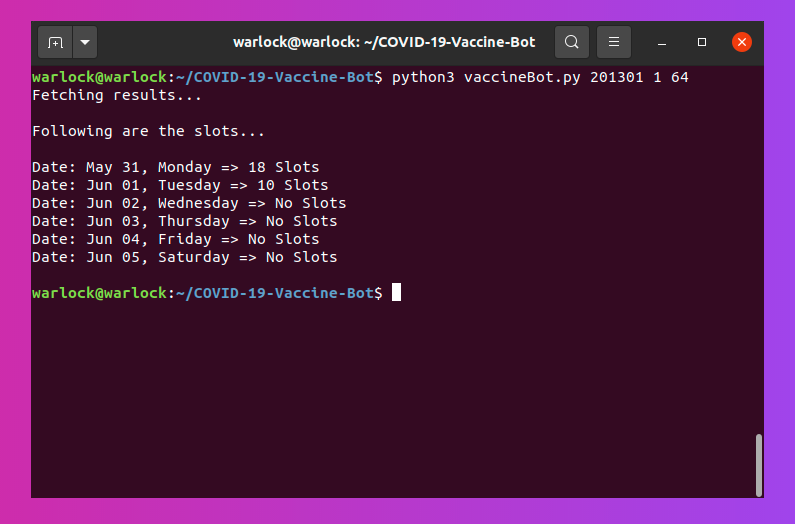
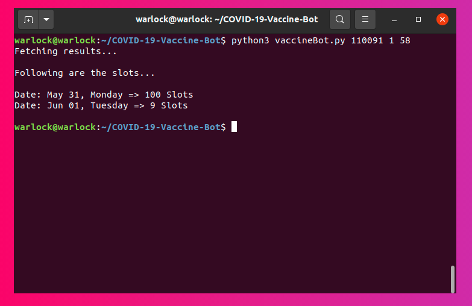

# COVID-19-Vaccine-Slot-Checking-Bot
Python Bot to check availability of COVID-19 Vaccine slots in India
 

## Usage
>python3 vaccineBot.py < pincode > < dose number > < age group >

The first argument is the pincode of the locality. The next argument takes in the numbers 1 and 2 based on the dose number. The last argument is the age group the person is looking for. 

For eg.
>python3 vaccineBot.py 201301 1 21

The above services the query for:
- locality with pincode 201301 
- dose number 1 
- age 21 
 

## Screenshots 

     
     

 

## Acknowledgement 
- VaccinateMe: <a href="https://www.vaccinateme.in/covid/">https://www.vaccinateme.in/covid/</a>

